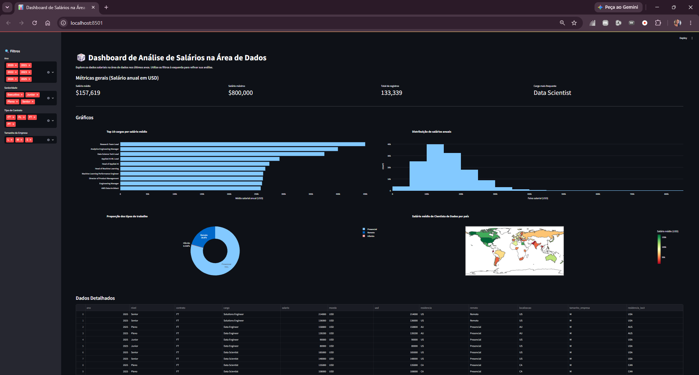
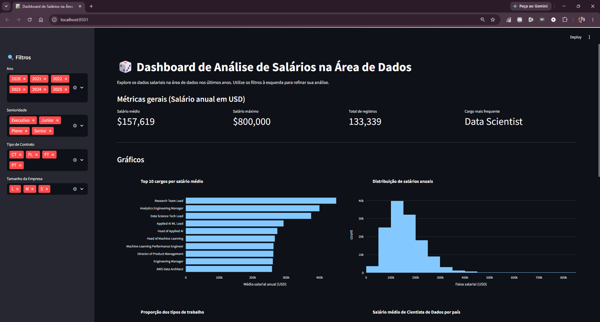
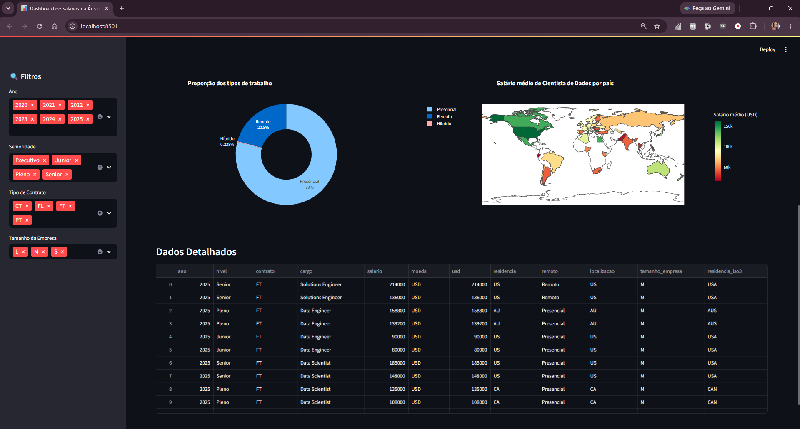

# 📊 Dashboard de Análise de Salários na Área de Dados

Projeto de análise de dados desenvolvido durante a **Imersão Dados com Python da Alura**, explorando informações sobre salários e características profissionais da área de dados.

O projeto reúne duas etapas: **exploração e tratamento dos dados em Python** e construção de um **dashboard interativo com Streamlit**, permitindo analisar diferentes recortes do conjunto de dados por meio de filtros e visualizações.

## 🎯 Objetivo

Explorar um conjunto de dados sobre profissionais da área de dados e transformar as informações em visualizações que facilitem a análise de salários, senioridade, modalidades de trabalho e diferenças entre países.

Após a etapa de exploração e tratamento, os dados preparados são utilizados em um dashboard interativo.

## 🔎 Etapas do projeto

### 1. Exploração e tratamento dos dados

A análise inicial foi realizada em um notebook Python, incluindo atividades como:

- inspeção da estrutura do dataset;
- análise de valores e categorias;
- padronização dos nomes das colunas;
- tratamento de valores ausentes;
- transformação de variáveis categóricas;
- conversão de tipos de dados;
- análise da distribuição dos salários;
- comparação de salários entre níveis de senioridade;
- análise das modalidades de trabalho;
- exploração da distribuição geográfica dos dados;
- criação de visualizações exploratórias.

O resultado dessa etapa é utilizado como base para o dashboard.

### 2. Dashboard interativo

A aplicação foi desenvolvida com **Streamlit** e permite aplicar diferentes filtros sobre os dados:

- ano;
- senioridade;
- tipo de contrato;
- tamanho da empresa.

Os indicadores e gráficos são atualizados conforme a seleção realizada.

## 📈 Indicadores

O dashboard apresenta quatro métricas principais:

- **salário médio anual em USD**;
- **maior salário registrado**;
- **quantidade de registros**;
- **cargo mais frequente**.

## 📊 Visualizações

Além dos indicadores, a aplicação apresenta:

- Top 10 cargos por salário médio;
- distribuição dos salários anuais;
- proporção entre modalidades de trabalho;
- salário médio de Data Scientists por país em mapa;
- tabela com os dados correspondentes aos filtros selecionados.

## 📸 Demonstração

### Visão geral



### Métricas e gráficos



### Análise geográfica e dados detalhados



## 🛠️ Tecnologias e bibliotecas

- Python
- Pandas
- Streamlit
- Plotly
- Matplotlib
- Seaborn
- Pycountry
- Jupyter Notebook / Google Colab
- Git e GitHub

## 📁 Estrutura do projeto

```text
imersao-dados-com-python-alura/
│
├── docs/
│   ├── dashboard-visao-geral.png
│   ├── dashboard-metricas-graficos.png
│   └── dashboard-mapa-dados.png
│
├── analise_dados.ipynb
├── app.py
├── dados-imersao-final.csv
├── requirements.txt
└── README.md
```

## 🚀 Como executar o dashboard

### 1. Clone o repositório

```bash
git clone https://github.com/juliane-lr/imersao-dados-com-python-alura.git
cd imersao-dados-com-python-alura
```

### 2. Instale as dependências

```bash
pip install -r requirements.txt
```

### 3. Execute a aplicação

```bash
streamlit run app.py
```

O Streamlit disponibilizará o endereço local da aplicação no navegador.

## 📚 O que pratiquei

Durante o desenvolvimento do projeto, pratiquei:

- exploração e limpeza de dados com Pandas;
- transformação e preparação de dados;
- análise exploratória;
- criação e interpretação de visualizações;
- construção de gráficos interativos;
- desenvolvimento de dashboards com Streamlit;
- aplicação de filtros sobre conjuntos de dados;
- apresentação de métricas e indicadores;
- organização de uma análise desde o notebook até uma aplicação interativa.

## 📌 Contexto

Projeto desenvolvido durante a **Imersão Dados com Python da Alura**, como atividade prática de análise, tratamento e visualização de dados com Python.

O notebook registra a etapa de exploração e preparação dos dados, enquanto o `app.py` utiliza o conjunto tratado para construir a interface interativa em Streamlit.
